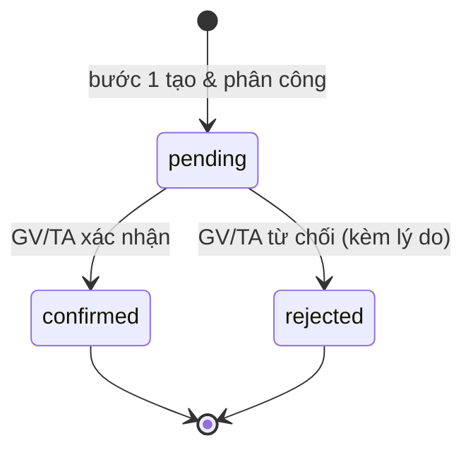

# Datapot BA Test — Hệ thống quản lý lịch dạy

## 1. Đề bài (tóm tắt)

Bạn được yêu cầu phân tích và prototype một **hệ thống quản lý lịch dạy** cho mảng đào tạo.

**Ba actor:** Coordinator (Điều phối), Giảng viên (GV), Trợ giảng (TA).

**Luồng đầy đủ gồm 5 bước** — bước 1 (tạo & phân công lịch) và bước 3 (phát hiện xung đột tự động) đã có sẵn trong hệ thống. Bạn chỉ cần phân tích và prototype 3 bước còn lại:

- **Bước 2 — Nhận & xác nhận lịch:** GV/TA xác nhận hoặc từ chối buổi dạy được phân công (kèm lý do nếu từ chối).
- **Bước 4 — Thay đổi lịch:** GV/TA gửi yêu cầu đổi/hủy buổi → Coordinator phê duyệt hoặc từ chối → hệ thống thông báo.
- **Bước 5 — Xem lịch tổng & cá nhân:** calendar theo tuần/tháng và danh sách buổi dạy của từng người.

---

## 2. Việc cần làm

| Output | File | Mô tả |
|---|---|---|
| Dataset Contract | `docs/00-dataset-contract.md` | Giả định dữ liệu đầu vào từ bước 1 & 3 |
| Requirements | `docs/01-requirements.md` | Problem statement, actors, assumptions, glossary |
| User Stories | `docs/02-user-stories.md` | Stories theo format Given/When/Then + MoSCoW |
| Process Flow | `docs/03-process-flow.md` | Sơ đồ luồng bằng Mermaid |
| Data Model / ERD | `docs/04-data-model.md` | ERD bằng Mermaid + data dictionary field-level |
| Screen Spec | `docs/05-screen-spec.md` | Spec từng màn: câu hỏi nghiệp vụ, dữ liệu, hành động |
| Prototype tương tác | `prototype/index.html` | 3 màn cốt lõi, mở được trực tiếp trên browser |

> **Thứ tự khuyến nghị:** điền `00` (dataset contract) trước — giả định dữ liệu ảnh hưởng đến toàn bộ thiết kế phía sau. Xem chi tiết quy trình trong [CONTRIBUTING.md](CONTRIBUTING.md).

---

## 3. Cách làm bài

1. **Fork** repo này về tài khoản GitHub cá nhân của bạn (nút **Fork** góc trên bên phải).
2. Clone về máy, làm bài trực tiếp trên nhánh `main`.
3. Điền theo thứ tự trong `docs/`: bắt đầu từ `00-dataset-contract.md` để xác định giả định dữ liệu, rồi lần lượt các file `01` → `05`.
   - Xóa các placeholder `<<< ... >>>` và thay bằng phân tích của bạn.
   - Xóa ví dụ mẫu (có nhãn "ví dụ — xóa") và thay bằng nội dung thực.
4. Mở rộng prototype trong `prototype/` — implement theo `docs/05-screen-spec.md`, hoàn thiện luồng, bổ sung validation.
5. Commit và push thường xuyên để Ban tổ chức có thể theo dõi tiến độ tư duy.
6. Xem [CONTRIBUTING.md](CONTRIBUTING.md) để biết commit style và checklist nộp bài.

---

## 4. Skills & công cụ theo từng phase

> Bạn được khuyến khích dùng bất kỳ công cụ nào — kể cả AI. Bảng dưới gợi ý các kỹ năng và tool phù hợp cho từng phase để bài làm chuyên nghiệp hơn.

| Phase | Deliverable | Kỹ năng cốt lõi | Tool gợi ý |
|---|---|---|---|
| **00** Dataset Contract | `docs/00-dataset-contract.md` | System boundary analysis · Data contract design | Notion / Confluence · AI (Claude) để draft |
| **01** Requirements | `docs/01-requirements.md` | Stakeholder analysis · Problem framing · Scope negotiation | AI (Claude) để cấu trúc · Notion |
| **02** User Stories | `docs/02-user-stories.md` | Story mapping · BDD (Given/When/Then) · MoSCoW prioritization | AI (Claude) để draft story · Jira / Linear để track |
| **03** Process Flow | `docs/03-process-flow.md` | BPMN · Swimlane diagram · Decision tree | **Mermaid** (có sẵn trong repo) · Miro · Lucidchart |
| **04** Data Model | `docs/04-data-model.md` | ER modeling · Normalization · Cardinality | **Mermaid erDiagram** (có sẵn) · dbdiagram.io · AI để review logic |
| **05** Screen Spec | `docs/05-screen-spec.md` | Information architecture · UX thinking · Wireframing | Figma · Whimsical · Balsamiq · AI để gợi ý layout |
| **Prototype** | `prototype/index.html` | HTML · CSS · Vanilla JS · Accessibility cơ bản | **Claude Code** để generate khung · VS Code · Chrome DevTools |

**Ghi chú về AI-assisted workflow:**
- AI (Claude, ChatGPT...) rất hiệu quả để **draft nhanh** requirements, stories, và spec — nhưng bạn phải **review và điều chỉnh** cho đúng nghiệp vụ.
- Reviewer sẽ đánh giá **tư duy phân tích** của bạn, không phải AI. Nội dung AI generate mà không có suy luận cá nhân sẽ dễ nhận ra.
- Dùng **Claude Code** để generate prototype HTML là hoàn toàn hợp lệ — nhưng bạn cần hiểu và có thể giải thích code đó.

---

## 5. Guideline — Sản phẩm sẵn sàng cho Dev

> Phần này dành cho ứng viên muốn đẩy bài làm lên mức **dev-ready**: tài liệu đủ để một developer bắt tay implement mà không cần hỏi lại BA về logic nghiệp vụ.

Ngoài 6 deliverable cơ bản, một bài hoàn chỉnh cho dev cần thêm:

### 5.1 State Machine — Sơ đồ trạng thái

Vẽ sơ đồ trạng thái cho **Session** và **ChangeRequest** — developer cần biết chính xác mọi chuyển trạng thái hợp lệ và điều kiện trigger.



> Thêm state diagram vào `docs/03-process-flow.md` hoặc tạo file riêng `docs/06-state-machine.md`.

### 5.2 Permission Matrix — Ma trận phân quyền

Ai được làm gì? Developer cần bảng này để implement authorization.

| Hành động | Coordinator | GV | TA |
|---|:---:|:---:|:---:|
| Xem lịch tổng tất cả người | ✅ | ❌ | ❌ |
| Xem lịch cá nhân của mình | ✅ | ✅ | ✅ |
| Xác nhận / từ chối buổi | ❌ | ✅ | ✅ |
| Gửi yêu cầu thay đổi | ❌ | ✅ | ✅ |
| Phê duyệt / từ chối yêu cầu thay đổi | ✅ | ❌ | ❌ |
| <<< thêm hành động >>> | | | |

> Bổ sung vào `docs/01-requirements.md` hoặc `docs/05-screen-spec.md`.

### 5.3 Notification Design — Ai nhận thông báo, khi nào

Developer cần biết trigger + recipient + nội dung để implement.

| Sự kiện | Trigger | Người nhận | Nội dung thông báo |
|---|---|---|---|
| Buổi mới được phân công | Bước 1 tạo Assignment | GV + TA | "Bạn được phân công buổi [X] vào [ngày]" |
| GV/TA xác nhận | status → confirmed | Coordinator | "[Tên] đã xác nhận buổi [X]" |
| GV/TA từ chối | status → rejected | Coordinator | "[Tên] từ chối buổi [X]: [lý do]" |
| Yêu cầu thay đổi mới | ChangeRequest tạo | Coordinator | "[Tên] yêu cầu [đổi/hủy] buổi [X]" |
| Coordinator phê duyệt | status → approved | GV + TA | "Yêu cầu thay đổi buổi [X] được chấp thuận" |
| Coordinator từ chối | status → rejected | GV + TA | "Yêu cầu thay đổi buổi [X] bị từ chối" |
| <<< thêm sự kiện >>> | | | |

### 5.4 Edge Cases & Validation Rules

Liệt kê các trường hợp biên mà developer cần xử lý. Ví dụ:

- Nếu GV từ chối → Coordinator có được tái phân công người khác không?
- Nếu buổi đã `confirmed` mà GV gửi yêu cầu hủy → flow khác gì so với buổi `pending`?
- Một GV có thể có nhiều yêu cầu thay đổi đang `pending` cùng lúc không?
- Yêu cầu `reschedule` được approve → ngày mới do ai cập nhật vào Session?
- <<< thêm edge case >>>

> Bổ sung vào `docs/01-requirements.md` phần Assumptions, hoặc tạo `docs/06-edge-cases.md`.

### 5.5 API Sketch (tùy chọn — điểm cộng)

Phác thảo các endpoint chính để developer hiểu boundary hệ thống. Không cần đầy đủ — chỉ cần đủ để align.

```
GET    /sessions?userId=&status=          # lấy danh sách buổi
PATCH  /assignments/:id/confirm           # xác nhận
PATCH  /assignments/:id/reject            # từ chối (body: reason)
POST   /change-requests                   # gửi yêu cầu thay đổi
PATCH  /change-requests/:id/approve       # Coordinator phê duyệt
PATCH  /change-requests/:id/reject        # Coordinator từ chối
GET    /sessions/calendar?userId=&week=   # lịch tuần
```

---

## 6. Cách chạy prototype

Không cần cài đặt bất kỳ thứ gì. Mở file `prototype/index.html` bằng trình duyệt (Chrome / Edge / Firefox) là chạy được ngay.

```
datapot-ba-test-demo/
└── prototype/
    └── index.html   ← mở file này
```

---

## 7. Cách nộp bài

1. Fork repo này về tài khoản GitHub cá nhân.
2. Làm bài trực tiếp trên nhánh `main`.
3. Push toàn bộ thay đổi lên GitHub.
4. Để repo ở chế độ **Public** (hoặc thêm reviewer theo hướng dẫn của Ban tổ chức).
5. Gửi **link repo cá nhân** của bạn cho Ban tổ chức qua kênh được chỉ định.

---

## 8. Checklist trước khi nộp

- [ ] `docs/00-dataset-contract.md` — đã điền thực thể đầu vào, fields, và ràng buộc.
- [ ] `docs/01-requirements.md` — đã điền đầy đủ: problem statement, actors, scope, assumptions, glossary.
- [ ] `docs/02-user-stories.md` — có ít nhất **3 user story** cho mỗi bước (2, 4, 5); mỗi story có AC (Given/When/Then) và priority MoSCoW.
- [ ] `docs/03-process-flow.md` — có ít nhất **2 sơ đồ luồng** chính (xác nhận lịch & yêu cầu thay đổi) vẽ bằng Mermaid.
- [ ] `docs/04-data-model.md` — ERD + data dictionary field-level (tên, kiểu, nullable, mô tả, ví dụ).
- [ ] `docs/05-screen-spec.md` — đã spec đủ 3 màn: câu hỏi nghiệp vụ, dữ liệu, hành động, filter.
- [ ] `prototype/index.html` — mở được ngay trên browser, 3 màn cốt lõi hoạt động.
- [ ] *(Dev-ready — điểm cộng)* State machine diagram cho Session & ChangeRequest.
- [ ] *(Dev-ready — điểm cộng)* Permission matrix đầy đủ.
- [ ] *(Dev-ready — điểm cộng)* Notification design (trigger, recipient, nội dung).
- [ ] *(Dev-ready — điểm cộng)* Edge cases & validation rules đã liệt kê.
- [ ] Repo đặt ở **Public** (hoặc đã add reviewer theo yêu cầu của BTC).
- [ ] Đã gửi link repo cho Ban tổ chức.
