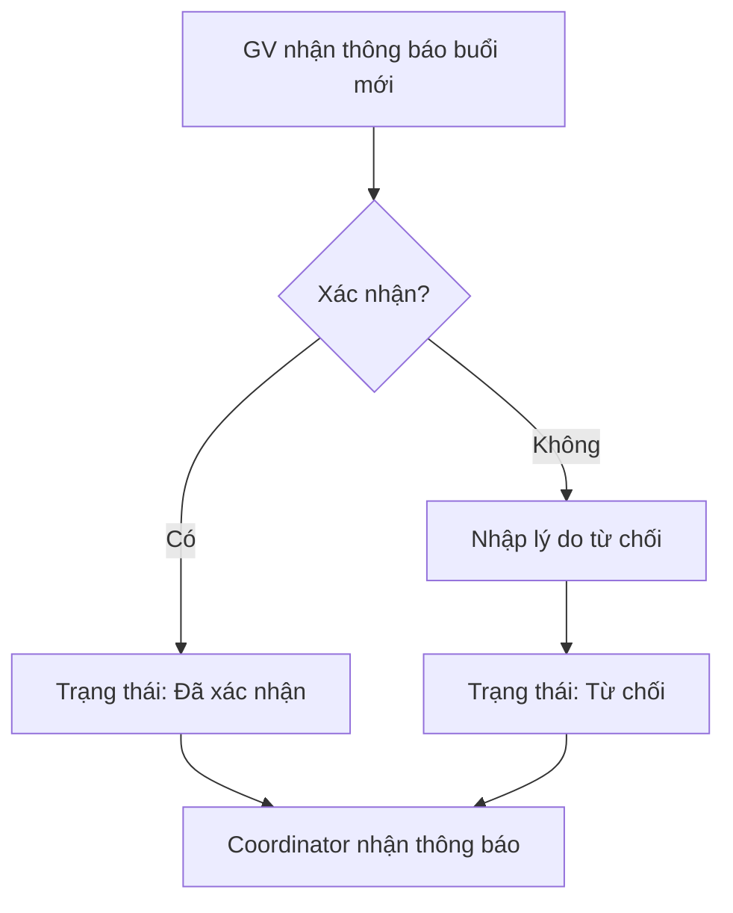
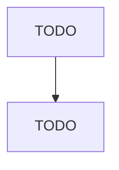

# Process Flow

> Vẽ sơ đồ bằng **Mermaid** (khối ` ```mermaid `). GitHub và nhiều editor (VS Code với extension) render trực tiếp.
> Tối thiểu cần 2 luồng chính: xác nhận/từ chối lịch và luồng yêu cầu → phê duyệt thay đổi.

---

## Ví dụ (xóa và thay bằng luồng của bạn)



---

## Luồng 1 — Xác nhận / từ chối lịch (Bước 2)

<<< vẽ luồng đầy đủ của bạn ở đây >>>



## Luồng 2 — Yêu cầu → phê duyệt thay đổi (Bước 4)

<<< vẽ luồng đầy đủ của bạn ở đây >>>


## Luồng 3 — Xem lịch (Bước 5) _(tùy chọn)_

<<< nếu có luồng phức tạp, vẽ thêm ở đây >>>
