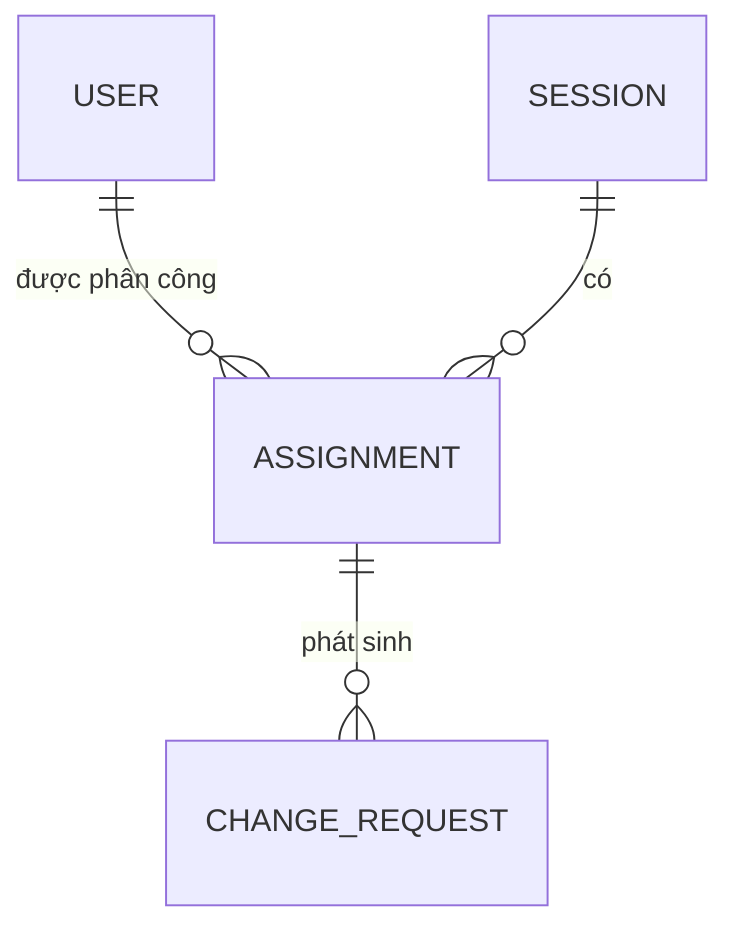
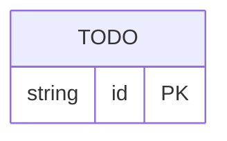

# Data Model / ERD

> Vẽ ERD bằng **Mermaid** (`erDiagram`). Mô hình phải hỗ trợ:
> - Trạng thái buổi dạy (pending → confirmed / rejected)
> - Yêu cầu thay đổi và vòng phê duyệt

---

## Ví dụ khởi đầu (mở rộng & sửa theo phân tích của bạn)

> Đây chỉ là 3 entity gợi ý với quan hệ tối giản. Bạn cần bổ sung thuộc tính, thêm entity còn thiếu, và hoàn thiện các quan hệ cho đúng với luồng nghiệp vụ đã phân tích.

---

## ERD của bạn

<<< thay thế ví dụ trên bằng ERD đầy đủ của bạn >>>

---

## Data Dictionary

> Liệt kê **từng field** của từng entity: tên, kiểu dữ liệu, nullable, mô tả, ví dụ.
> Mô hình phải nhất quán với `docs/00-dataset-contract.md` (đầu vào từ upstream)
> và `docs/05-screen-spec.md` (đầu ra hiển thị trên prototype).

### USER

| Field | Kiểu | Nullable | Mô tả | Ví dụ |
|---|---|---|---|---|
| user_id | UUID | No | Khóa chính | `"u-001"` |
| full_name | string | No | Họ và tên | `"Nguyễn Văn An"` |
| role | enum | No | Vai trò: `gv` / `ta` / `coordinator` | `"gv"` |
| email | string | No | Email — dùng cho thông báo | `"an@edu.vn"` |
| <<< thêm field >>> | | | | |

### SESSION

| Field | Kiểu | Nullable | Mô tả | Ví dụ |
|---|---|---|---|---|
| session_id | UUID | No | Khóa chính | `"s-001"` |
| subject | string | No | Tên môn / buổi học | `"Python cơ bản"` |
| date | date | No | Ngày diễn ra | `2026-07-01` |
| start_time | time | No | Giờ bắt đầu | `08:00` |
| end_time | time | No | Giờ kết thúc | `10:00` |
| room | string | Yes | Phòng học | `"P.201"` |
| <<< thêm field >>> | | | | |

### ASSIGNMENT

| Field | Kiểu | Nullable | Mô tả | Ví dụ |
|---|---|---|---|---|
| assignment_id | UUID | No | Khóa chính | `"a-001"` |
| session_id | FK → SESSION | No | Buổi được phân công | |
| user_id | FK → USER | No | Người được phân công | |
| role_in_session | enum | No | `gv` hoặc `ta` trong buổi này | `"gv"` |
| status | enum | No | <<< pending / confirmed / rejected >>> | `"pending"` |
| reject_reason | string | Yes | Lý do từ chối (chỉ khi rejected) | |
| confirmed_at | datetime | Yes | Thời điểm xác nhận / từ chối | |
| <<< thêm field >>> | | | | |

### CHANGE_REQUEST

| Field | Kiểu | Nullable | Mô tả | Ví dụ |
|---|---|---|---|---|
| request_id | UUID | No | Khóa chính | `"cr-001"` |
| assignment_id | FK → ASSIGNMENT | No | Phân công liên quan | |
| type | enum | No | `reschedule` / `cancel` | `"reschedule"` |
| reason | string | No | Lý do yêu cầu | |
| proposed_date | date | Yes | Ngày mới đề xuất (nếu đổi lịch) | `2026-07-09` |
| status | enum | No | <<< pending / approved / rejected >>> | `"pending"` |
| requested_at | datetime | No | Thời điểm gửi yêu cầu | |
| resolved_at | datetime | Yes | Thời điểm Coordinator xử lý | |
| <<< thêm field >>> | | | | |

---

## Câu hỏi mở về model

<<< ghi lại các điểm chưa rõ, ví dụ:
- CHANGE_REQUEST nối với ASSIGNMENT hay SESSION trực tiếp?
- Khi Coordinator approve reschedule, ai cập nhật SESSION.date?
- Cần lưu lịch sử trạng thái (state history) không?
>>>
