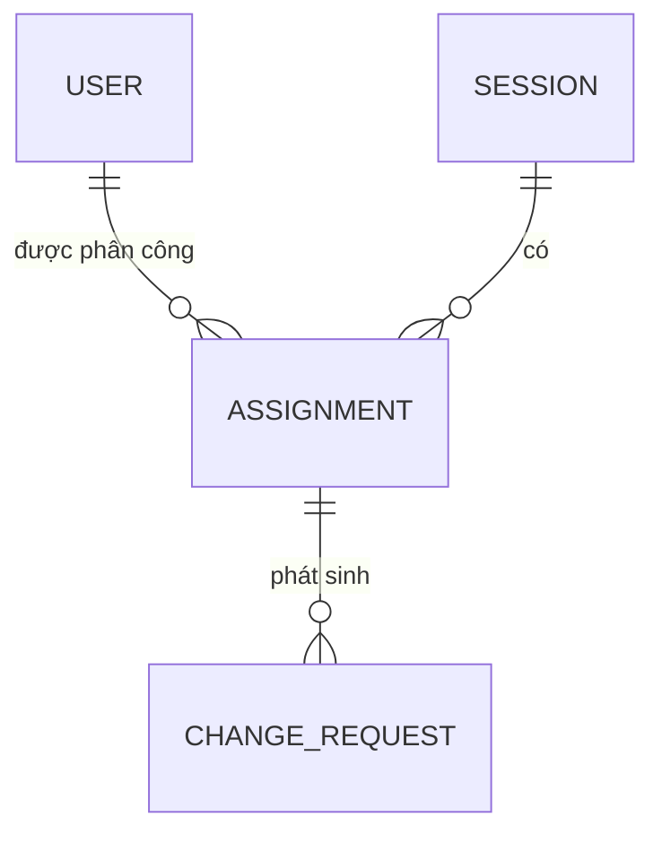
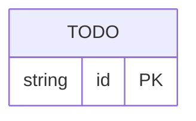

# Data Model / ERD

> Vẽ ERD bằng **Mermaid** (`erDiagram`). Mô hình phải hỗ trợ:
> - Trạng thái buổi dạy (pending → confirmed / rejected)
> - Yêu cầu thay đổi và vòng phê duyệt

---

## Ví dụ khởi đầu (mở rộng & sửa theo phân tích của bạn)

> Đây chỉ là 3 entity gợi ý với quan hệ tối giản. Bạn cần bổ sung thuộc tính, thêm entity còn thiếu, và hoàn thiện các quan hệ cho đúng với luồng nghiệp vụ đã phân tích.

---

## ERD của bạn

<<< thay thế ví dụ trên bằng ERD đầy đủ của bạn >>>

---

## Mô tả entity

<<< bổ sung bảng mô tả từng entity và thuộc tính quan trọng >>>

| Entity | Thuộc tính chính | Ghi chú |
|---|---|---|
| USER | id, name, role (gv/ta/coordinator), email | <<< >>> |
| SESSION | id, subject, date, time, room, status | <<< trạng thái nào? >>> |
| ASSIGNMENT | id, sessionId, userId, role_in_session | <<< GV hay TA trong buổi này >>> |
| CHANGE_REQUEST | id, assignmentId, type, reason, status, requestedAt | <<< >>> |
